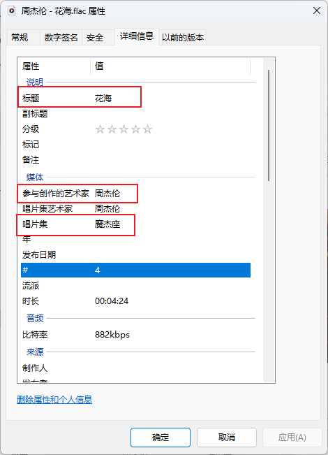

# JMusic｜本地音乐播放器

## 功能🧩

### 歌词显示✨

根据`标题`+`艺术家`+`唱片集`自动匹配歌词，请确保此三项存在：

### 歌词展开✨

鼠标移入歌词区域，左侧区域显示竖杠，点击展开歌词。

### 专辑图显示✨

自动加载歌曲内置专辑图显示。

### 全屏及浅色/深色切换✨

操作列表上的功能按钮区。

## 开发🎨

- [Tauri 2.0](https://tauri.app/zh-cn/)
- [Rust](https://www.rust-lang.org/zh-CN/)
- [React 18](https://zh-hans.react.dev/)
- [TypeScript](https://www.typescriptlang.org/)
- [HeroUI](https://www.heroui.com/)
- [Tailwindcss](https://v3.tailwindcss.com/)

## 安全🎯

如提示风险可忽略继续安装。

## 下载🎉

- [jmusic_1.0.2_x64-setup.exe](./1.0.1/jmusic_1.0.2_x64-setup.exe)
- [jmusic_1.0.1_x64-setup.exe](./1.0.1/jmusic_1.0.1_x64-setup.exe)
- [jmusic_1.0.0_x64-setup.exe](./1.0.0/jmusic_1.0.0_x64-setup.exe)
